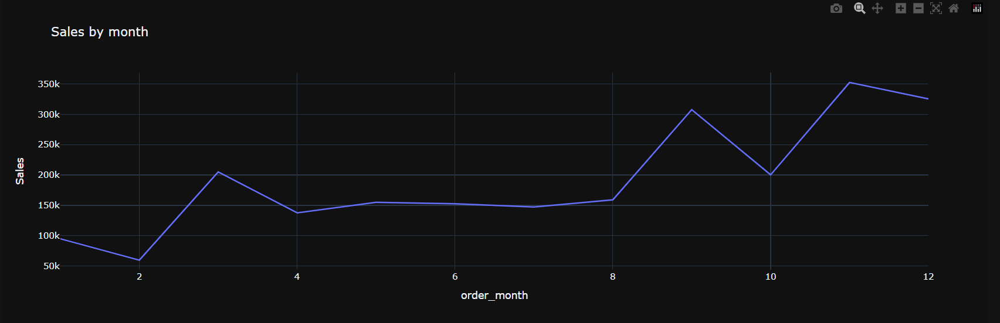
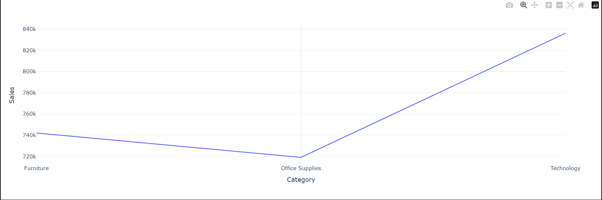
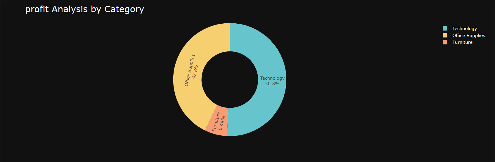
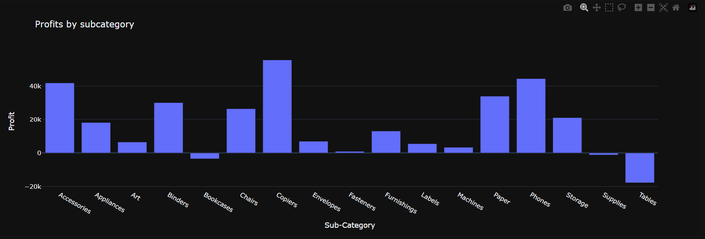
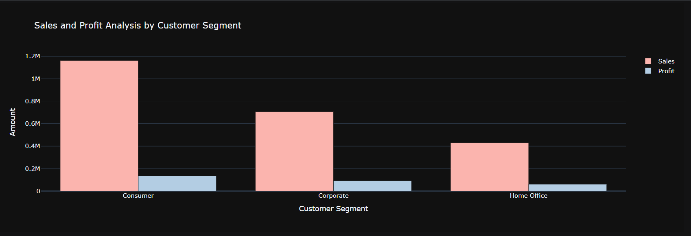

## Project Objective
This project analyzes e-commerce sales and profit data to identify trends, category performance, customer behavior, and business insights using Python and Plotly.

---

## Tools & Technologies Used
- Python
- Pandas
- NumPy
- Plotly
- PyCharm

---

## Business Problems Solved
1. Monthly sales analysis
2. Highest and lowest sales month
3. Category-wise sales analysis
4. Sub-category sales analysis
5. Monthly profit analysis
6. Profit by category and sub-category
7. Sales and profit by customer segment
8. Sales-to-profit ratio analysis

---

## Project Screenshots

### Monthly Sales Analysis

### Category Sales Analysis

### Profit by Category

### Profit by Subcategory

### Sales and Profit Category

---

## Key Insights
- Technology category generated highest sales
- Some categories showed lower profit margins
- Sales trends varied significantly by month
- Customer segment analysis revealed revenue concentration

---

## Conclusion
This project improved my skills in:
- Data cleaning
- Exploratory Data Analysis
- Business insight generation
- Data visualization

